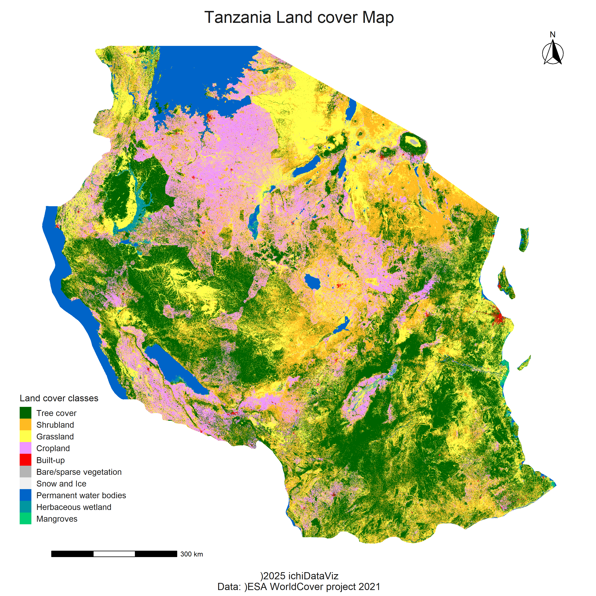

```{r setup, include=FALSE}
knitr::opts_chunk$set(echo = FALSE)
```


### 1. Load Required Libraries

pacman::p_load(
  rstac, sf, terra,
  tidyverse, elevatr,
  ggtern, ggspatial,
  rayshader,
  rnaturalearth, rnaturalearthdata
)

### 2. Define Country Boundaries using rnaturalearth package

country_sf <- rnaturalearth::ne_countries(
  scale = "medium", 
  returnclass = "sf", 
  country = "United Republic of Tanzania"
)

country_bbox <- sf::st_bbox(country_sf)

### 3. Query ESA Land Cover Data

ms_query <- rstac::stac(
  "https://planetarycomputer.microsoft.com/api/stac/v1"
)

ms_collections <- ms_query |>
  rstac::collections() |>
  rstac::get_request()

print(ms_collections, n = 123)

collections <- "esa-worldcover"

ms_esa_query <- rstac::stac_search(
  q = ms_query,
  collections = collections,
  datetime = "2021-01-01T00:00:00Z/2021-12-31T23:59:59Z",
  bbox = country_bbox
) |>
  rstac::get_request()

### 4. Download ESA Land Cover Data

ms_query_signin <- rstac::items_sign(
  ms_esa_query, rstac::sign_planetary_computer()
)

main_dir <- getwd()

rstac::assets_download(
  items = ms_query_signin,
  asset_names = "map",
  output_dir = main_dir, overwrite = TRUE
)

### 5. Load and Crop ESA Land Cover Data

version <- "v200"
year <- "2021"
asset_name <- "map"

data_dir <- file.path(
  main_dir, collections,
  version, year, asset_name
)

raster_files <- list.files(
  data_dir,
  full.names = TRUE
)

land_cover_raster <- terra::vrt(raster_files)

country_sf <- sf::st_transform(
  country_sf,
  crs = sf::st_crs(land_cover_raster)
)

country_land_cover <- terra::crop(
  land_cover_raster,
  country_sf,
  snap = "in",
  mask = TRUE
)

terra::plot(country_land_cover)

### 6. Fetch and Clean Original Colors

raster_color_table <- do.call(
  data.frame, terra::coltab(
    country_land_cover
  )
)

### Convert RGB to hex using base R function rgb()
cols <- rgb(
  raster_color_table[, 2] / 255,  # Red
  raster_color_table[, 3] / 255,  # Green
  raster_color_table[, 4] / 255   # Blue
)

### Remove black color (if present)
cols <- cols[!cols == "#000000"]
country_land_cover <- na.omit(country_land_cover)

### 7. Obtain and Resample DEM Data

dem <- elevatr::get_elev_raster(
  locations = country_sf,
  z = 9, clip = "locations"
) |>
  terra::rast()

proj <- "EPSG:4668"

country_land_cover_resampled <- terra::resample(
  x = country_land_cover,
  y = dem, method = "near"
) |>
  terra::project(
    proj,
    method = "near"
  )

### 8. Set up Visualization Theme

theme_for_the_win <- function(){
  theme_minimal() +
    theme(
      axis.line = element_blank(),
      axis.title.x = element_blank(),
      axis.title.y = element_blank(),
      axis.text.x = element_blank(),
      axis.text.y = element_blank(),
      panel.grid.major = element_blank(),
      panel.grid.minor = element_blank(),
      plot.background = element_rect(
        fill = "white", color = NA),
      plot.title = element_text(
        size = 20, color = "grey10",
        hjust = .5, vjust = -2
      ),
      plot.caption = element_text(
        size = 9, color = "grey10",
        hjust = .5, vjust = 3
      ),
      plot.margin = unit(
        c(
          t = 0, r = 0,
          l = 0, b = 0
        ), "lines"
      )
    )
}

### 9. Prepare Data for Plotting

values <- seq(10, 100, by = 10)
values <- append(values, 95, after = 9)

labels <- c(
  "Tree cover", "Shrubland", "Grassland",
  "Cropland", "Built-up", "Bare/sparse vegetation",
  "Snow and Ice", "Permanent water bodies",
  "Herbaceous wetland", "Mangroves", "Moss and lichen"
)

codebook <- data.frame(
  values = values,
  labels = labels,
  cols = cols
)

country_land_cover_resampled_df <- as.data.frame(
  country_land_cover_resampled,
  xy = TRUE, na.rm = TRUE
)

names(country_land_cover_resampled_df)[3] <- "values"
codebook$values <- as.numeric(
  as.character(codebook$values)
)

country_land_cover_df <- dplyr::left_join(
  country_land_cover_resampled_df,
  codebook, by = "values"
)

country_land_cover_df$values <- as.factor(
  country_land_cover_df$values
)

labs <- labels[labels %in% unique(
  country_land_cover_df$labels
)]

pal <- cols[cols %in% unique(
  country_land_cover_df$cols
)]

### 10. Generate Land Cover Map

lc_map <- ggplot() +
  geom_raster(
    data = country_land_cover_df,
    aes(
      x = x, y = y,
      fill = as.factor(values)
    )
  ) +
  scale_fill_manual(
    name = "Land cover classes",
    values = pal,
    labels = labs
  ) +
  guides(
    fill = guide_legend(
      direction = "vertical",
      barwidth = unit(.5, "cm"),
      barheight = unit(.5, "cm")
    )
  ) +
  annotation_scale(
    location = "bl", width = .15,
    pad_x = unit(1.5, "cm"),
    pad_y = unit(.5, "cm")
  ) +
  annotation_north_arrow(
    location = "tr",
    style = north_arrow_fancy_orienteering,
    pad_x = unit(.5, "cm"),
    pad_y = unit(.5, "cm")
  ) +
  coord_sf(crs = proj) +
  labs(
    title = "Tanzania Land cover Map",
    caption = "©2025 ichiDataViz\nData: ©ESA WorldCover project 2021"
  ) +
  theme_for_the_win() +
  theme(
    plot.caption = element_text(size = 12),  # 👈 Enlarge caption text here
    legend.background = element_blank(),
    legend.position = c(.1, .2),
    legend.title = element_text(
      size = 11, color = "grey10"
    ),
    legend.text = element_text(
      size = 10, color = "grey10"
    )
  )

ggsave(
  "Tanzania-landcover-2d.png", lc_map,
  width = 10, height = 10, bg = "white"
)

### 11. Generate DEM Map

dem_df <- as.data.frame(
  terra::project(
    dem, proj
  ),
  xy = TRUE, na.rm = TRUE
)

names(dem_df)[3] <- "dem"

dem_map <- ggplot() +
  geom_raster(
    data = dem_df,
    aes(
      x = x, y = y, fill = dem
    )
  ) +
  scale_fill_gradientn(
    colors = "white"
  ) +
  guides(fill = "none") +
  coord_sf(crs = proj) +
  theme_for_the_win() +
  theme(
    legend.position = "none"
  )

### 12. Render 3D Map with Rayshader

rayshader::plot_gg(
  ggobj = lc_map,
  ggobj_height = dem_map,
  width = 7,
  height = 7,
  windowsize = c(800, 800),
  scale = 150,
  shadow = TRUE,
  shadow_intensity = 1,
  phi = 87,
  theta = 0,
  zoom = .55,
  multicore = TRUE
)

u <- "https://dl.polyhaven.org/file/ph-assets/HDRIs/hdr/4k/brown_photostudio_02_4k.hdr"
hdri_file <- basename(u)

download.file(
  url = u,
  destfile = hdri_file,
  mode = "wb"
)

rayshader::render_highquality(
  filename = "Tanzania-esa-3d.png",
  preview = TRUE,
  light = FALSE,
  environment_light = hdri_file,
  intensity = 1,
  rotate_env = 90,
  parallel = TRUE,
  width = 2000,
  height = 2000,
  interactive = FALSE
)





