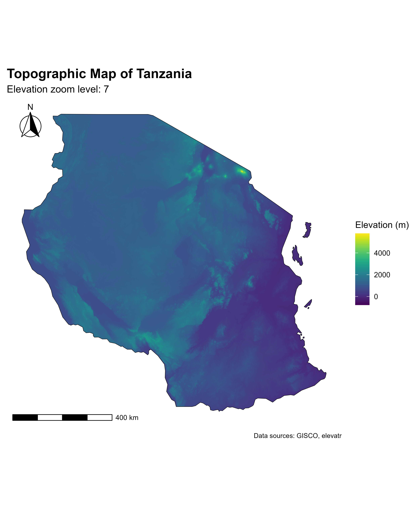

```{r setup, include=FALSE}
knitr::opts_chunk$set(echo = FALSE)
```

### In this project we are going to use R packages to generate styled topographic map of Tanzania using elevation data and boundaries

### 1. Load Required Libraries

libs \<- c("elevatr", "terra", "tidyverse", "sf", "giscoR", "osmdata",
"marmap")

### Install missing packages

installed_libs \<- libs %in% rownames(installed.packages()) if
(any(!installed_libs)) { install.packages(libs[!installed_libs]) }

#### Load packages

invisible(lapply(libs, library, character.only = TRUE))

### 2. Get Country Boundary (Tanzania)

crsLONGLAT \<- "+proj=longlat +datum=WGS84 +no_defs"

get_country_sf \<- function() { giscoR::gisco_get_countries( year =
"2020", epsg = "3035", resolution = "10", country = "TZ" ) \|\>
sf::st_transform(crs = crsLONGLAT) }

country_sf \<- get_country_sf()

### 3. Download Elevation Data for Full Country

get_elevation_data \<- function() { elevatr::get_elev_raster(locations =
country_sf, z = 7, clip = "locations") }

country_elevation \<- get_elevation_data()

#### Optional: View raster

#### terra::plot(country_elevation)

### 4. Download Elevation Data using BBOX Clip

get_elevation_data_bbox \<- function() {
elevatr::get_elev_raster(locations = country_sf, z = 7, clip = "bbox") }

country_elevation \<- get_elevation_data_bbox() \|\> terra::rast()

### 5. Plot Full Country Elevation Raster with ggplot

country_elevation \|\> as.data.frame(xy = TRUE) \|\> ggplot() +
geom_tile(aes(x = x, y = y, fill = file3fe06008316b)) + geom_sf(data =
country_sf, fill = "transparent", color = "yellow", size = 0.25) +
theme_void()

### 6. Crop Raster to Custom Bounding Box (BBOX)

get_area_bbox \<- function() { xmin \<- 29.32698; xmax \<- 40.6584071
ymin \<- -11.76125; ymax \<- -0.9854812

sf::st_sfc( sf::st_polygon(list(cbind(c(xmin, xmax, xmax, xmin, xmin),
c(ymin, ymin, ymax, ymax, ymin)))), crs = crsLONGLAT ) }

bbox \<- get_area_bbox()

crop_area_with_polygon \<- function() { bbox_vect \<- terra::vect(bbox)
cropped \<- terra::crop(country_elevation, bbox_vect)
terra::mask(cropped, bbox_vect) }

bbox_raster_final \<- crop_area_with_polygon()

#### Plot cropped area

bbox_raster_final \|\> as.data.frame(xy = TRUE) \|\> ggplot() +
geom_tile(aes(x = x, y = y, fill = file3fe06008316b)) + geom_sf(data =
country_sf, fill = "transparent", color = "black", size = 0.25) +
theme_void()

### 7. Use OSM Data to Get Region Outline (Tanzania)

region \<- "United Republic of Tanzania" united_republic_of_tanzania_sf
\<- osmdata::getbb(region, format_out = "sf_polygon")

#### Plot OSM outline

ggplot() + geom_sf(data = united_republic_of_tanzania_sf, color = "red",
fill = "grey80", size = 0.5) + theme_void()

### 8. Crop Elevation Raster to OSM Region (for exact shape match)

crop_region_with_polygon \<- function() { region_vect \<-
terra::vect(united_republic_of_tanzania_sf) cropped \<-
terra::crop(country_elevation, region_vect) terra::mask(cropped,
region_vect) }

region_raster_final \<- crop_region_with_polygon()

#### Get raster band name for plotting

elev_col \<- names(region_raster_final)[1]

#### Plot region-masked elevation raster

region_raster_final \|\> as.data.frame(xy = TRUE) \|\> ggplot() +
geom_tile(aes(x = x, y = y, fill = .data[[elev_col]])) + geom_sf(data =
united_republic_of_tanzania_sf, fill = "transparent", color = "black",
size = 0.25) + theme_void()

### 9. Generate Final Styled Elevation Map with `marmap`

get_elevation_map \<- function() { df \<- country_elevation \|\>
as.data.frame(xy = TRUE) \|\> na.omit() names(df)[3] \<- "elevation"

ggplot(data = df) + geom_raster(aes(x = x, y = y, fill = elevation),
alpha = 1) + marmap::scale_fill_etopo() + coord_sf(crs = crsLONGLAT) +
labs(x = "", y = "") + theme_minimal() + theme( axis.line =
element_blank(), axis.text = element_blank(), axis.ticks =
element_blank(), legend.position = "none", panel.grid = element_blank(),
plot.margin = unit(rep(0, 4), "cm"), plot.background = element_blank(),
panel.background = element_blank(), panel.border = element_blank() ) }

country_map \<- get_elevation_map() print(country_map)

### 10. Save Map as PNG (Optional)

ggsave( filename = "united_republic_of_tanzania_topo_map.png", plot =
country_map, width = 7, height = 8.5, dpi = 600, bg = "white" )



